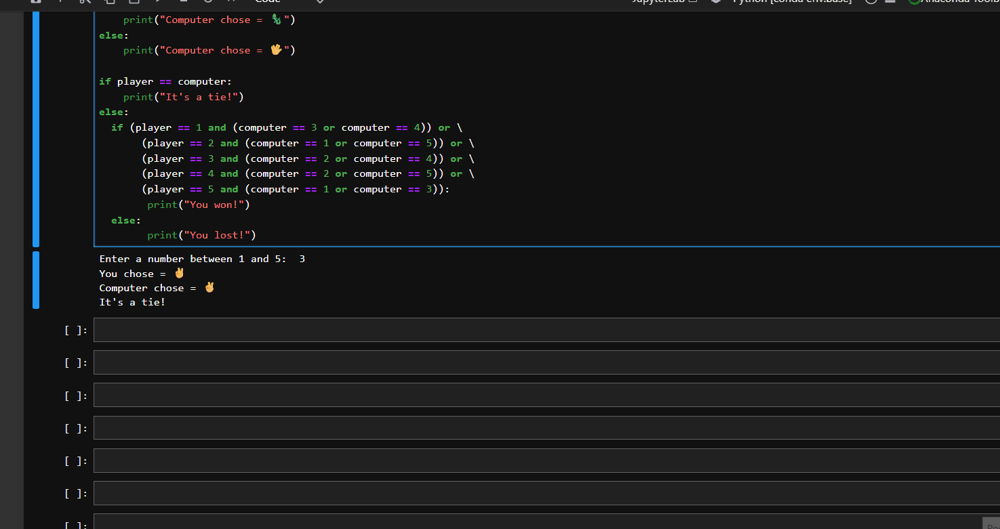

# Rock Paper Scissors Lizard Spock 🎮  

This is a Python implementation of the **Rock, Paper, Scissors, Lizard, Spock** game inspired by [The Big Bang Theory](https://youtu.be/IFurn06BDuc?si=J4rDdpsTAFthVIby).  

---

## 📚 Concepts Applied
- `if`, `else`, and `elif` statements (recently learned in class)  
- Basic Python game logic  
- User input handling  

---

## ▶️ How to Run
Clone the repository and run the script:  
```bash
python rock_paper_scissors.py

---

##  Demo
Here’s how the game looks when played in a terminal:



